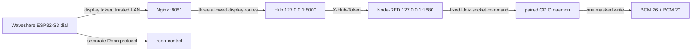

# System architecture

This document describes the active `manual_timed` installation. For dated proof
of what has been observed, use [PROJECT_STATE.md](PROJECT_STATE.md). Source code,
deployed processes, GPIO levels and physical valve position are separate facts.

## Active control path

The Waveshare dial switches between valve and Roon pages locally. The Roon path
is implemented in the separate
[`roon-knob`](https://github.com/danikeuc/roon-knob) and
[`roon-control`](https://github.com/danikeuc/roon-control) repositories. It has
no authority over the Pi relay daemon.

## Component ownership

| Component | Owns | Interface and exposure | Failure behavior |
| --- | --- | --- | --- |
| Waveshare dial | User interaction and displayed Hub status | `GET` status and bodyless `POST` actions through trusted-LAN Nginx | Shows unavailable/unknown and disables valve action when status is unavailable |
| Nginx | LAN gateway allowlist | Port `8081`; exactly three display routes | Rejects every other route; the Hub and Node-RED remain loopback-only |
| Hub | Operating mode, 600-second timer, policy, audit state | FastAPI on `127.0.0.1:8000`; separate admin/display/Node-RED tokens | Requests `DRAIN` on startup, expiry and command failure |
| Node-RED | Authenticated translation to the fixed GPIO client | One loopback `POST` route; no policy timer and no individual GPIO nodes | Rejects invalid token/command and reports failures to the Hub |
| Paired GPIO daemon | Sole GPIO writer and paired readback | Root-controlled Unix socket under `/run/freeze-protect` | Starts at high/high and expires an unrenewed `SUPPLY` lease within 60 seconds |
| Relays and valves | Electrical and hydraulic movement | BCM 26 and 20 drive separate active-low relay inputs | Physical result requires direct observation or position feedback |

## Operating modes

| Mode | Idle state | Can start `SUPPLY` | Inputs that can start it |
| --- | --- | --- | --- |
| `safe_drain` | `SAFE_DRAIN` | No | None |
| `manual_timed` | `MANUAL_DRAIN` | Yes, fixed 600 seconds | One authenticated deliberate display action |
| `automatic` | `FROST_PROTECTION` until sensor/forecast gates pass | Yes | Commissioned healthy PT100/MAX31865 and eligible seven-day forecast |

The active installation uses `manual_timed`. Weather and temperature do not
start `SUPPLY` in this mode. The `automatic` mode remains implemented for a
future separately commissioned configuration.

## Display temperature telemetry

The authenticated display status includes only `pipe_temperature_c` and
`sensor_health` for temperature. The numeric value is present only when the
reading is healthy and fresh; otherwise it is JSON `null`. Health is reported
as `HEALTHY`, `STALE`, `INVALID`, or `CALIBRATION_REQUIRED`. Non-automatic
modes use `TemperatureTelemetrySampler` at a five-second cadence. Automatic
mode uses `ControlService.last_reading`; the sampler is absent in that mode, so
the temperature source has one reader at a time. A reading at least 15 seconds
old is `STALE`, and a failed sample clears the numeric value rather than
reusing an earlier reading. MAX31865 diagnostics remain administrator-only.

This display telemetry has no control authority. In `manual_timed`, temperature
does not start, extend, stop, or authorize `SUPPLY`; showing a reading does not
set `sensor_commissioned`. Automatic-policy use still requires its separate
sensor commissioning.

## Paired output contract

| Logical command | BCM 26 | BCM 20 | Intended plumbing path |
| --- | ---: | ---: | --- |
| `DRAIN` (`0` in the dial UI) | high | high | `Tuš` to `Izpust` |
| `SUPPLY` (`1` in the dial UI) | low | low | `Dovod` to `Tuš` |

Mixed levels are illegal. A command receipt and `pinctrl` readback establish the
software output state only. They do not establish relay contact state, valve
movement or the plumbing path.

## Trust and secret boundaries

- Admin, display and Node-RED tokens are independent and stored outside Git.
- The dial receives only its display token and the Nginx base URL.
- The restricted `freezeprotect-commission` SSH identity exposes four fixed
  commands and no shell, forwarding, GPIO group or environment access.
- Node-RED is bound to loopback. Its exported flow is versioned here, while the
  deployed active flow and runtime versions remain separate evidence.
- Port `8081` is for a trusted local network and must not be forwarded to the
  internet.

## Active and historical sources

The active dial firmware does not live in this repository. Current display
commissioning is in
[`deployment/DISPLAY_COMMISSIONING.md`](../deployment/DISPLAY_COMMISSIONING.md).
The source under `firmware/crowpanel` and
[`deployment/CROWPANEL_COMMISSIONING.md`](../deployment/CROWPANEL_COMMISSIONING.md)
is retained as historical/rollback material and is not provisioned with the
active display token.

## Required failure validation

The implementation has explicit responses for communication loss, Hub
crash/hang, controller restart and power loss/restoration. Test coverage is not
physical proof. The current proof level and remaining deployed/physical checks
are maintained in [PROJECT_STATE.md](PROJECT_STATE.md).
