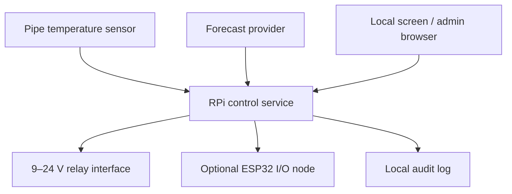

# RPi Freeze Protect — architecture and first delivery design

## Purpose

RPi Freeze Protect protects a vulnerable water installation from freezing. A Raspberry Pi is the local control hub. It reads a temperature sensor attached directly to the cold-water pipe below the insulation, applies a conservative protection policy, controls low-voltage relays located on the warm side, and provides a local screen and browser-based administration.

The system must continue to protect the installation without Internet access. Weather data is only an additional condition for an automatic *release/open* decision; it never substitutes for a local sensor or safety interlock.

This first delivery deliberately separates the safety-relevant control core from GPIO, weather and UI adapters. It can therefore be tested with a simulated sensor and relay pair before any physical device is connected.

## Scope and milestones

| Milestone | Outcome | Hardware required |
| --- | --- | --- |
| M0 — Control core and simulator | A locally runnable service with a pure policy engine, REST API, persisted audit events, simulated pipe sensor and simulated relays. | No |
| M1 — Raspberry Pi integration | Real one-wire temperature input, safe GPIO relay adapter and a local status/control screen. | Raspberry Pi, sensor, relay interface |
| M2 — ESP32 node | Signed/versioned ESP32 firmware and a local hub-to-node protocol for the agreed remote I/O role. | ESP32 and its final wiring |
| M3 — Operational automation | Forecast integration, notifications, historical trends and the automatic release rule. | Internet access optional |

M0 is the first implementation target. It must prove that the controller is safe, observable and testable before a relay can move any physical component.

## Design choices

Three implementation approaches were considered:

1. Direct GPIO script on the Pi: fast to demonstrate but difficult to test and too easy to make unsafe.
2. Home Assistant automation as the control authority: useful for dashboards but creates a dependency on a larger platform for a local safety function.
3. **Dedicated local service with adapter interfaces (selected):** a small Python service owns the policy and state; GPIO, ESP32, weather, display and browser UI are replaceable adapters.

The selected approach keeps the protection function deterministic and local, while retaining MQTT and Home Assistant as optional integrations later.

## System boundaries



The Raspberry Pi is the sole control hub. ESP32 firmware is a peripheral I/O node, not a second decision-maker. An unavailable ESP32, unavailable forecast provider or disconnected browser must never change the hub's safe behaviour.

## Core model

### Inputs

- `pipe_temperature_c`: timestamped reading from the sensor clamped to the cold-water pipe, inside/under the insulation.
- `sensor_health`: present, stale, invalid or calibration-required.
- `manual_command`: open, close/protect, stop, or clear fault; available only to an authenticated local administrator.
- `configuration`: thresholds, hysteresis, action hold times, weather-release policy and safety mode.
- `forecast`: optional daily-minimum forecast values and time of retrieval.

### Outputs

- `relay_command`: `OPEN`, `CLOSE_OR_PROTECT`, or `STOP`.
- `controller_state`: `STARTING`, `MONITORING`, `PROTECTING`, `RELEASE_PENDING`, `MANUAL_LOCK`, or `FAULT`.
- `audit_event`: immutable timestamped record of readings, commands, decisions and configuration changes.

`OPEN` and `CLOSE_OR_PROTECT` are logical commands. Their mapping to relay channels, pulse length and any interlock will be configured during M1 after the actual actuator and wiring are confirmed. This avoids assuming that a particular energized/de-energized relay state is safe.

### Safety policy

1. On boot, restart, configuration validation failure, sensor fault or stale reading, the controller enters `FAULT` and sends no automatic movement command.
2. The two physical direction relays must be mutually exclusive. Any request that would energize both is rejected and logged.
3. A sustained temperature below the configured protection threshold moves the controller to `PROTECTING`. Hysteresis and a minimum dwell period prevent relay chatter.
4. A normal local temperature alone never permits an automatic `OPEN` command. Automatic release additionally requires a valid forecast satisfying the configured condition — by default, every daily minimum over the next seven days is above +5 °C.
5. Missing, expired or contradictory forecast data blocks automatic release; it does not block a manual administrator command after its confirmation step.
6. Every command is idempotent, time-bounded and recorded. Hardware movement beyond the configured maximum pulse duration results in `FAULT`.
7. The local screen always exposes state, last sensor value, last command, fault reason and a manual emergency stop.

Exact protection threshold, sensor-stale timeout, actuator pulse time and the fail-safe physical wiring are commissioning values, not source-code constants.

## Software architecture

The M0 Python 3.12 service will use FastAPI only as an outer API layer. The decision engine has no FastAPI, GPIO, MQTT or database dependency.

```text
src/freeze_protect/
  domain/        # state machine, policy, value objects
  application/   # control cycle and command use cases
  adapters/      # simulated sensor/relays first; GPIO, weather, MQTT later
  api/           # REST endpoints and local admin authentication
  persistence/   # configuration and append-only audit events
tests/
  unit/          # policy and state-transition tests
  integration/   # API, persistence and simulator tests
docs/
```

SQLite is the local persistence store for M0–M2: it is robust, simple to back up and sufficient for one Pi. Configuration changes are versioned; audit events are append-only. The service binds to loopback by default and may be exposed to the trusted LAN only after administrator credentials are configured.

## Interfaces

### Internal interfaces

- `TemperatureSource.read() -> TemperatureReading`
- `RelayDriver.command(command, duration) -> CommandReceipt`
- `ForecastSource.daily_minima() -> ForecastSnapshot`
- `EventStore.append(event)` and `SettingsStore.load()/save()`

### M0 HTTP API

- `GET /health` — service and dependency health.
- `GET /api/v1/status` — current state, readings and active configuration version.
- `GET /api/v1/events` — paged audit history.
- `POST /api/v1/commands/{open|protect|stop}` — authenticated manual action with a confirmation token.
- `GET/PUT /api/v1/settings` — authenticated, validated configuration management.
- `POST /api/v1/simulation/temperature` — development-only simulated input; disabled outside development mode.

The local display and later web page use the same API. No control behaviour is implemented in the UI.

## Failure handling and observability

- Sensor timeouts, invalid readings, persistence errors, relay-driver errors and forecast failures become explicit faults/events rather than silent fallbacks.
- The status endpoint reports whether the system is allowed to automate, and why not.
- Structured JSON logs go to stdout; a rotating local file may be added during Pi deployment.
- Startup performs a configuration schema check and a relay-driver self-check that cannot energize a channel.

## Test strategy and acceptance criteria for M0

The implementation will be test-driven. Unit tests cover all state transitions and boundary temperatures; integration tests exercise API-to-audit-log behaviour with simulated adapters.

M0 is accepted when all of the following are demonstrated on a development machine:

1. A simulated low/stale/invalid sensor reading creates the expected `PROTECTING` or `FAULT` state without any real GPIO access.
2. `OPEN` is refused unless the sensor is healthy, the release criteria are met, and no manual lock/fault is active.
3. Conflicting relay commands cannot be emitted.
4. A restart preserves the latest validated configuration and audit trail; it never resumes an interrupted movement command.
5. Every manual command and automatic decision has a queryable audit record.
6. The test suite and static checks pass in a clean clone.

## Commissioning prerequisites for M1

Before connecting relays, record and verify:

- exact Raspberry Pi model, OS image and power supply;
- temperature sensor model, cable length and calibration check;
- actuator voltage/current, relay module datasheet, fusing and electrical isolation;
- whether the intended physical safe state is de-energized, and the measured relay polarity;
- actual open/close travel time and any end-stop feedback;
- ESP32 model and whether it is a remote I/O node or display device;
- trusted LAN range and initial local administrator credential.

No automatic physical actuation will be enabled until these values are entered, validated and tested with the actuator disconnected.

## Explicit non-goals for M0

- direct control of production relays or GPIO;
- remote Internet control, cloud dependence or third-party account integration;
- Home Assistant as a safety dependency;
- ESP32 firmware or weather-provider credentials;
- predictive/AI control decisions.
