# Weather-assisted shower — approved design

Status: **IMPLEMENTED REPOSITORY CANDIDATE**, 2026-10-03. Owner-approved source contracts are implemented and exercised with local software tests. [Current verification](../../evidence/2026-10-03-weather-plan-validation.md) records pinned revisions, the owner-approved 36-edge inventory closure and the documented bridge baseline strict-test-lint limitation. Local affected gates pass; the current policy/documentation delta is READY_FOR_LOCAL_ACCEPTANCE_REVIEW. The earlier planning approval remains historical. No deployment, firmware flash, live playback, GPIO or physical acceptance follows from source approval or these checks.

## Owner review summary — scope resumed 2026-10-03

The owner requested resuming weather automation only. BLE remotes, remote
pairing and remote shower control are excluded from this increment. This
scope was subsequently approved on 2026-10-03; BLE remains excluded.
The newly requested Roon playlist favorites will have a separate design so
playlist work does not alter the weather or actuator contracts.

Potrjeni povzetek:

- Pet dni pomeni danes in naslednje štiri lokalne dni. Vseh pet napovedanih
  minimumov mora biti vsaj 5,0 °C, da je dovoljen stalni dotok.
- Napoved se osvežuje vsakih 15 minut. Neuspešno pridobivanje, nepopolna,
  neveljavna ali prestara napoved vrne ročno časovno upravljanje.
- Že začeti ročni interval se izteče ob prvotnem roku; vremenska sprememba
  ga ne podaljša. Trajanje ostane nastavljivo od 1 do 10 minut.
- Ročni STOP ostane veljaven do novega namernega START, tudi po ponovnem zagonu.
- V obstoječi admin strani dodamo vklop vremenske pomoči in lokacijo.
  Na strani tuša se pri stalnem dotoku prikaže AUTO. PT100 ostane informativen.
- Privzeto je avtomatika izklopljena. Namestitev in vklop na napravah sta
  ločena od implementacije ter zahtevata ustrezno preverjanje strojne opreme.

The detailed timeout, fault, compatibility and credential contracts below
remain the accepted design contract; current implementation evidence is linked above.

## 1. Intent and baseline

Keep the outdoor shower supply continuously available during sufficiently warm
forecast periods. When the forecast is cold or unavailable, retain the existing
one-to-ten-minute, deliberately started shower behavior. A manual stop must win
over automatic reopening. PT100/MAX31865 remains informational.

Source baselines, inspected 2026-10-02:

- Pi v1.1.0 merge: `87b12236af955ec068ddd673b7b702ebc09fe846`.
- Dial v1.1.0 merge: `9bd5fc062d91f9ca7b3c6bd4c54dc60481129007`.
- Previously recorded installed behavior: Pi source `52c0815c17ecd94d4939c2995a0cced3a40be8bc`
  and Dial build source `9b1ca059f0142098d2f510637351941d842f4979`.
  These are earlier observations, not a fresh device attestation.
- Pi Python requirement is >=3.12; Dial hardware-tested toolchain is ESP-IDF
  5.5.5. Implementation must verify the actual target runtime/build again.

This proposal supersedes the old seven-day/sensor-dependent policy only for a
new opt-in `weather_assisted` mode. Existing `manual_timed`, `safe_drain` and
legacy `automatic` retain their contracts; do not enable legacy automatic mode.
Release v1.1.0 and its assets remain immutable.

## 2. Approach and boundaries

**Selected:** Raspberry Pi owns weather decisions, durable preferences, manual
inhibition and actuator state. Dial provides the existing mobile admin and
shower UI. The existing paired daemon remains the sole GPIO writer.

Alternatives considered: enabling the old automatic mode would impose a
seven-day, strictly-above-threshold and commissioned-sensor policy that differs
from the request. Putting decisions on the Dial would make weather control
rely on its connectivity and duplicate authority. Neither is selected.

Reuse the Open-Meteo adapter, SQLite persistence, authenticated API and protocol
2 begin/renew bridge. Do not create Node-RED weather logic, another GPIO owner,
cloud control service, or a second weather source in this increment. Roon,
lighting, PIN recovery and screen rotation behavior are outside the change.

## 3. Agreed behavior and proposed timing defaults

| Condition | Requested outcome |
| --- | --- |
| Enabled, no manual inhibition/fault, complete eligible forecast | Continuous logical SUPPLY=1; no shower countdown |
| Any of five minima below 5.0 C | Manual fallback, idle DRAIN=0 |
| Missing/invalid/stale forecast, failed refresh, missing location | Manual fallback, idle DRAIN=0 |
| Forecast becomes eligible again | Resume AUTO unless inhibited or faulted |
| Deliberate stop while supply is on | DRAIN and persist manual inhibition |
| Fresh deliberate start after a stop | Clear inhibition; AUTO if eligible, otherwise one bounded shower |
| Forecast fails/becomes cold during a manually started interval | Keep the original deadline, then DRAIN |
| Forecast becomes warm during a manually started interval | Do not extend/convert the interval; at expiry confirm DRAIN, then allow a subsequent policy cycle to enter AUTO |

Five days means **today plus the next four local calendar dates**, timezone
`Europe/Ljubljana` by default. All five minima must be **>=5.0 C**; exactly 5.0
qualifies. No hidden hysteresis or PT100 veto is introduced. Forecast eligibility
is a convenience rule, not evidence of local pipe temperature or valve position.

Approved engineering defaults:

- Refresh on startup, enable, location change and local-date rollover, then
  every 900 monotonic seconds. Failed attempts retry at that cadence.
- Latest attempt failure invalidates AUTO immediately when the control service
  processes it, even if an older successful snapshot is cached.
- A fetch result must arrive within 5 seconds to be eligible. A late result
  cannot restore AUTO. Total snapshot lifetime is at most 1,200 monotonic
  seconds, including detection of a missing/stalled worker.
- A completed result wakes the control loop. Target processing bound is one
  existing control cycle (30 seconds); validate it with simulated timing.
  This is not instant detection of an internet outage: normally it is detected
  at the next fetch, up to 900 + 5 + 30 seconds after connectivity is lost.
- Missing current-day coverage at midnight invalidates the old snapshot until
  a new five-day snapshot is accepted. DST follows local dates, not 24-hour math.
- A fresh qualifying fetch restores AUTO without requiring two samples, provided
  no explicit stop or fault blocks it. No duplicate transition while already on.

## 4. State, persistence and transitions

States proposed for the new policy: `MANUAL_IDLE`, `MANUAL_ACTIVE`,
`AUTO_SUPPLY`, `USER_OFF`, and `FAULT`. Configured mode, effective operation,
forecast eligibility and actuator command must be separate fields.

Priority: fault/invalid durable state -> explicit user inhibition -> existing
manual deadline -> eligible AUTO -> manual idle. All transition decisions and
actuator intents are serialized by the Pi control service.

Persist enable preference, requested coordinates/timezone, settings revision,
manual inhibition and fault inhibition in Pi SQLite. Persist a manual stop
before acknowledging success; request DRAIN even if persistence fails and latch
FAULT. Failed/missing/corrupt durable state must not permit AUTO. A fresh START
must clear a stored inhibition durably before SUPPLY; failure leaves DRAIN.

Fresh installation defaults to weather disabled. Effective weather operation
requires both an explicitly deployed `weather_assisted` mode and the saved
weather-enabled preference; deployment cannot switch the current installation
into AUTO implicitly. Enable in admin is an explicit control-affecting action,
with a visible explanation that an eligible forecast permits continuous supply.
It does not clear a previous manual/fault inhibition.

Admin disable cancels AUTO and returns DRAIN, but does not truncate an already
accepted manual timer. A location/timezone change invalidates in-flight/cached
weather and triggers refresh; an active manual deadline remains unchanged.
Rotation/duration/PIN changes do not affect weather preferences or inhibition.

After Hub restart: verify startup DRAIN/protocol 2, restore preferences and
inhibitions, discard active actuator intent and require a new successful weather
fetch. Never resume a saved manual interval. A persisted marker for an interrupted
manual interval inhibits AUTO until a new deliberate START; a normally completed
interval clears that marker only after confirmed DRAIN. This prevents reboot
from turning an interrupted short shower into continuous supply.

Weather transport/validation failure is a fallback reason, not a latched device
FAULT. Actuator, renewal, persistence or unknown-command-effect failures are
FAULTs. A fresh weather success must never clear them. Fault clear confirms
DRAIN and leaves inhibition until a distinct fresh START; no auto begin retry.

```mermaid
stateDiagram-v2
    [*] --> MANUAL_IDLE: startup DRAIN; fresh weather required
    MANUAL_IDLE --> AUTO_SUPPLY: enabled + eligible + no inhibition
    AUTO_SUPPLY --> MANUAL_IDLE: cold / unavailable / disabled
    MANUAL_IDLE --> MANUAL_ACTIVE: deliberate START; AUTO unavailable
    MANUAL_ACTIVE --> MANUAL_IDLE: original deadline; confirmed DRAIN
    AUTO_SUPPLY --> USER_OFF: deliberate STOP
    MANUAL_ACTIVE --> USER_OFF: deliberate STOP
    USER_OFF --> AUTO_SUPPLY: fresh START; eligible
    USER_OFF --> MANUAL_ACTIVE: fresh START; AUTO unavailable
    MANUAL_IDLE --> FAULT: control or persistence fault
    MANUAL_ACTIVE --> FAULT: control or persistence fault
    AUTO_SUPPLY --> FAULT: control or persistence fault
    USER_OFF --> FAULT: control or persistence fault
    FAULT --> USER_OFF: fault clear + confirmed DRAIN
```

Diagram shows proposed normal transitions; persisted USER_OFF/FAULT overrides
initial MANUAL_IDLE, and restart never restores active output.

## 5. Forecast contract and concurrency

Existing `ForecastSnapshot`, settings and parser hard-code seven entries.
Introduce explicit window validation for this mode; retain seven-day behavior
and decoding for the legacy mode. Old cache records do not authorize the new
mode. Request `daily=temperature_2m_min`, `forecast_days=5`, Celsius, and the
configured timezone. Require exactly five consecutive current local dates,
finite numeric minima and matching units/timezone semantics; reject null,
boolean, missing, duplicated, truncated and malformed values.

Bind each request/result to the requested location, timezone, settings revision
and fetch generation. Save requested coordinates separately from returned grid
coordinates. Returned Open-Meteo coordinates describe a model grid cell and can
differ from the requested point; the current 0.01-degree equality check is not
an appropriate identity proof. Validate coordinate ranges and bind provenance
to the authenticated HTTPS request rather than rewriting requested coordinates.
Never apply an old-location or old-generation reply to current settings.

Use HTTPS certificate verification and a bounded response size (64 KiB). Reject
unexpected redirects rather than follow an arbitrary host. The provider's
`generationtime_ms` is processing duration, not forecast issuance time. Record
retrieval time honestly; source issue time stays unknown when not supplied.
These API semantics are documented in [Open-Meteo API docs](https://open-meteo.com/en/docs)
(checked 2026-10-02).

Move weather network work outside the control lock and renewal loop. Permit
only one outstanding worker request; use an immutable result handoff and a
monotonic result deadline. A stalled worker cannot prevent DRAIN, manual timer
expiry, lease renewals or bounded shutdown. Do not create unbounded replacement
threads after a hang. Invalid clock/date or unexpected clock reversal disables
AUTO until a new valid snapshot/time basis; weather age does not rely solely
on wall time. Cancellation, late replies and settings changes are tested.

## 6. Actuator contract and fault boundaries

Legal paired levels: GPIO26/20 high/high = logical DRAIN=0;
low/low = logical SUPPLY=1. Mixed pairs are prohibited. Logical values and
physical active-low pin levels are not interchangeable.

Continuous supply means repeated valid protocol-2 renewal, not an infinite GPIO
command or removal of the daemon's existing 60-second lease. Use BEGIN only
on a deliberate authorized state transition after verified DRAIN; use RENEW
while active. An expired/restarted lease, failed receipt or ambiguous response
requires DRAIN/FAULT. Do not fall back from RENEW to BEGIN automatically.

| Fault | Required outcome / mechanism | Timing and proof boundary |
| --- | --- | --- |
| Weather internet/provider loss | Pi invalidates AUTO; manual timer can finish | Detection bounds above; new tests required |
| Dial Wi-Fi loss | Pi continues eligible AUTO or accepted manual timer; no replay after reconnect | Existing policy ownership retained; new mode needs tests |
| Hub-to-daemon loss or Hub crash/hang | Independent daemon requests DRAIN after renewal expiry | Existing 60-second lease while daemon runs; new deployed/physical evidence absent |
| GPIO daemon crash/hang | DRAIN required; Hub must not automatically rearm | Independent enforcement and response bound not established; hardware commissioning gap |
| Pi reset/reboot | Startup DRAIN; no cached AUTO/active-timer restoration | Pre-application GPIO behavior and physical timing not yet verified |
| Dial reset/power cycle | Restore UI preferences, request authoritative Pi status; no START replay | Must not change Pi AUTO/USER_OFF state |
| Pi power loss/restoration | Required DRAIN, then conservative startup | Physical outcome/response time unverified |
| Relay/driver power loss/restoration | Required DRAIN with no uncommanded restoration | Supply-specific physical outcome/time unverified |
| Valve 24 V loss/restoration | Required drain routing, no unsafe restored flow | Passive/mechanical behavior/time unverified |

These are requirements and known gaps, not passed hardware tests. Sustained
relay/valve duty suitability must be established from the actual installed
hardware before commissioning continuous supply. This design authorizes no
live actuation, power change, deployment or additional physical test.

## 7. Dial, API and admin ownership

Keep the accepted shower icon: water dots only for a current SUPPLY report,
small relay ON/OFF indicator, temperature with one decimal, and `AUTO` instead
of a countdown during continuous supply. `USER_OFF` displays OFF; the admin
page explains the manual inhibition. Stale/unreachable status shows unknown,
not a fabricated OFF or running AUTO. Preserve the existing deliberate START
and stop gestures, screen swipes and Roon behavior.

Extend display status additively with a weather-assistance capability version,
effective operation, weather availability/eligibility/reason and inhibition.
Existing command/state/remaining fields retain meaning. An AUTO value with zero
remaining seconds must not be confused with an expired manual countdown.

Preserve `/api/v1/display/actions/timed-shower` as explicitly bounded behavior;
it must never become unlimited SUPPLY for an old client. Add an explicit new
start/resume action consumed only after fresh compatible capability. Each new
action carries a unique request ID and expected control revision. Replays,
out-of-order STOP/START and retries cannot extend timers or clear a later stop.
DRAIN remains available; in weather mode a deliberate display DRAIN persists
inhibition. Internal weather fallback DRAIN must not set that user inhibition.
The Dial retains its 10-second unsent START limit and no-replay behavior.

Pi owns weather settings; Dial owns its existing local duration/rotation/PIN.
The authenticated phone admin proxies a narrow weather settings resource and
shows confirmed Pi read-back. No offline queued enabling, optimistic saved
label, or secrets in HTML/status/logs. Use expected settings revision to reject
concurrent stale writes; after timeout read back before any retry.

Keep general Pi admin API loopback-only. Add only exact weather settings and
explicit action routes to the Nginx allowlist. Weather settings writes require
a separate restricted weather-settings credential provisioned privately on Pi
and Dial; the existing display credential must not gain general admin power.
PIN session/CSRF/Host/Origin checks protect the Dial proxy; the Pi verifies the
restricted credential and schema independently. Provisioning and credential
rotation belong in the later deployment plan, never in public files. Changing
the PIN alone does not rotate device-to-device credentials.

Admin fields: weather assistance on/off, latitude/longitude and timezone;
read-only five minima, last successful check, failure reason and actual Pi
operation. Fixed five-day/5 C/15-minute rules are visible, not additional sliders.
Actual site coordinates are entered by the owner before enable, not inferred
from historical addresses. No map/geocoding subsystem is required.

## 8. Compatibility, evidence and next phase

New firmware with old Pi: retain current manual controls, mark weather settings
unsupported, never attempt new routes without capability. Old firmware with new
Pi: existing timed action stays bounded and STOP still inhibits automation;
weather enable is commissioned only with the compatible new Dial. Unknown new
state must remain unknown on older clients, not be misrepresented as a timer.

Add persistence schema changes additively and test upgrade with weather disabled,
existing configuration retained and old cache excluded. Rollback requires
weather disabled, confirmed DRAIN, stopped compatible Pi stack and a protected
pre-migration database/config backup; do not assume old code can read new records.
Preserve the immutable paired v1.1.0 release and exact tested firmware for rollback.

Existing source anchors for the implementation plan:

| Repository | Existing paths / responsibility |
| --- | --- |
| Pi | `src/freeze_protect/domain/models.py`, `domain/policy.py`: forecast and decisions |
| Pi | `src/freeze_protect/application/service.py`, `application/ports.py`: control, loop and ports |
| Pi | `src/freeze_protect/adapters/weather.py`, `persistence/sqlite.py`: provider and durable state |
| Pi | `src/freeze_protect/api/app.py`, `api/auth.py`, `main.py`: contracts, credential scope and runtime mode |
| Pi | `deployment/nginx/freeze-protect-display.conf`, `deployment/node-red/paired_gpio_daemon.py`: routes and preserved lease |
| Dial | `idf_app/main/valve_logic.[ch]`, `valve_client_dial.[ch]`, `valve_ui_dial.[ch]`: status, actions and display |
| Dial | `idf_app/main/admin_server_dial.c`, `admin_backend_dial.[ch]`, `admin_page_dial.h`: authenticated weather settings UI |

Required evidence before review: threshold 4.9/5.0/5.1, five-day completeness,
midnight/DST/clock changes, failure despite warm cache, fetch timeout/late result,
manual-stop persistence across process/power recovery, interrupted manual timer,
unchanged deadline through warm/cold transitions, settings races, authorization,
old/new compatibility, lease refusal, crash/hang boundaries and additive migration.
Use production control/adapter paths with injected clocks/transports; mocks do
not establish relay or hydraulic behavior. Run repository-native Python checks,
shared/admin/valve firmware suites and exact-target build for implementation.

Python Engineering Guardrails provides implementer preflight, not independent
approval. Independent Engineering Reviewer is a separate read-only review of
pinned plan/code and underlying evidence. RPi evidence reconciliation retains
historical scope; Imperator-specific platform ownership is not imported here.
The Mermaid diagram is a proposal, not an as-built hardware diagram.

**Historical next gate at design approval:** produce the implementation plan with exact tasks, contracts,
tests, migration, review and deployment gates, then obtain plan review and
execution-method confirmation. Design approval is not deployment, live
actuation or release approval. Roon playlist favorites are a companion scope
with their own design decisions; BLE remotes remain excluded.

That planning/review/selection gate was subsequently approved and source implementation proceeded. Current pinned candidate verification and remaining acceptance gates are in the [validation record](../../evidence/2026-10-03-weather-plan-validation.md); deployment/live-actuation/release remain separately unauthorized.

Accepted implementation plans: [Weather plan](../plans/2026-10-03-weather-assisted-shower.md)
and [companion playlist plan](../plans/2026-10-03-roon-playlist-favorites.md).
